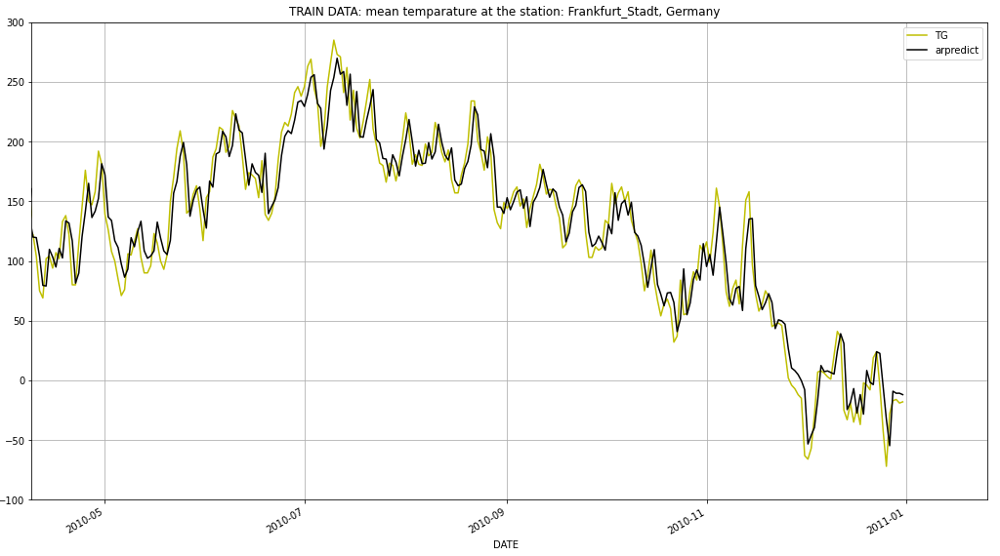

# Temperatur_Analysis
Temperatur forecast as Time Series Analysis with ARIMA

## Data

Data set of the daily mean temperatur for a station (Frankfurt_Stadt) ranging for 150 years from https://www.ecad.eu/. 

## Methods

Cleaning data and adding four lag columns to predict a day's temperatur by the values of the days before.

* `sklearn.linear_model` for trend and seasonality
* `statsmodels.graphics.tsaplots` to investigate the orders of (partial) autocorrelation of the remainder
* `statsmodels.tsa.ar_model` to select orders
* `pmdarima.arima` ro run auto_arima

## Results

After evaluating different combination of parameters i settled for:
- ARIMA (4,0,0)
- 1.631 °C mean absolute error

(Test and train data making no difference here. For every data point the value of the day itself functions as the test data and the value of the four days before as the training data. An exception being trend and seasonality which was calculated from the full data.)

